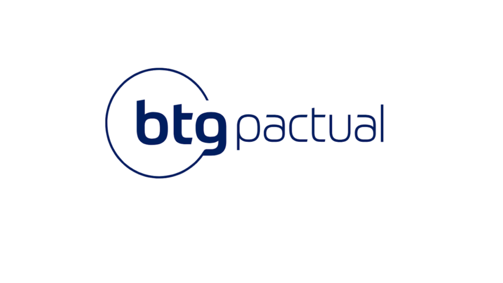

     

<h3 align="center">
  Desafio Backend do BTG Pactual
</h3>

  
  
  

##  Tecnologias utilizadas

* Java 21
* Spring Boot
* Spring Data MongoDB
* RabbitMQ
* Docker

### Como rodar o container

Entrar na pasta local `cd local` rodar o comando
` docker compose up`